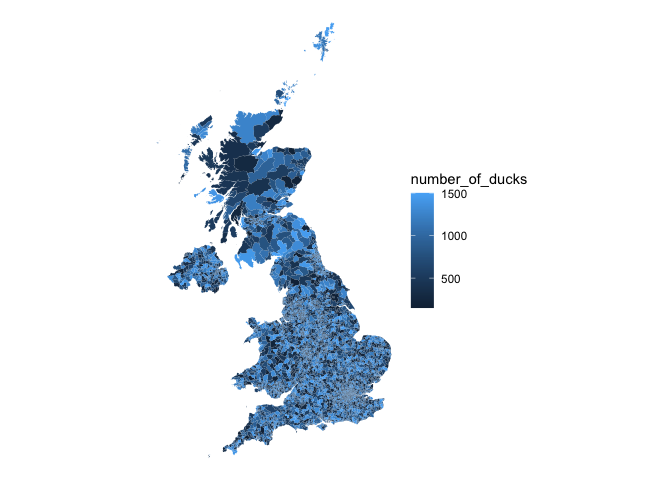

<!-- README.md is generated from README.Rmd. Please edit that file -->

# wardboundaries

<p align="center">

</p>
<!-- badges: start -->

[](https://www.repostatus.org/#wip)
<!-- badges: end -->

## Overview

**wardboundaries** is an R data package for mapping UK ward boundaries.

The main objects in the package are
[sf](https://r-spatial.github.io/sf/) tibbles of ward boundaries,
obtained from the ONS Open Geography Portal.

- All the original variables and observations are retained and a
  `geometry` column of type MULTIPOLYGON has been added
- LAD codes and names have been added to datasets where required, as I
  believe they will prove useful in most use cases

The data is ready to be joined to measurements and plotted with
e.g. `ggplot2` or `leaflet`.

### Current datasets

**20m resolution**

- countries_dec2022_20m
- lad_dec2022_20m
- lad_may2023_20m
- wards_dec2022_20m
- wards_may2023_20m

**200m resolution**

- wards_dec2011
- wards_dec2019
- wards_dec2020
- wards_dec2021
- wards_dec2022
- wards_may2023

**500m resolution**

- countries_dec2022
- lad_dec2022
- lad_may2023

## Installation

``` r
devtools::install_github("jimgar/wardboundaries")
```

## Use and examples

### Access

Accessing a dataset can be done two ways.

By namespace, without loading the whole library

``` r
wardboundaries::wards_dec2022
#> Simple feature collection with 8483 features and 12 fields
#> Geometry type: MULTIPOLYGON
#> Dimension:     XY
#> Bounding box:  xmin: -8.649996 ymin: 49.88234 xmax: 1.763571 ymax: 60.86087
#> Geodetic CRS:  WGS 84
#> # A tibble: 8,483 × 13
#>    WD22CD    WD22NM   WD22NMW LAD22CD LAD22NM  BNG_E  BNG_N  LONG   LAT OBJECTID
#>    <chr>     <chr>    <chr>   <chr>   <chr>    <int>  <int> <dbl> <dbl>    <int>
#>  1 E05000650 Astley … " "     E08000… Bolton  370670 412906 -2.44  53.6        1
#>  2 E05000651 Bradshaw " "     E08000… Bolton  374590 413058 -2.39  53.6        2
#>  3 E05000652 Breight… " "     E08000… Bolton  374437 409641 -2.39  53.6        3
#>  4 E05000653 Bromley… " "     E08000… Bolton  372113 414150 -2.42  53.6        4
#>  5 E05000654 Crompton " "     E08000… Bolton  371741 410493 -2.43  53.6        5
#>  6 E05000655 Farnwor… " "     E08000… Bolton  373564 406162 -2.40  53.6        6
#>  7 E05000656 Great L… " "     E08000… Bolton  371959 408204 -2.42  53.6        7
#>  8 E05000657 Halliwe… " "     E08000… Bolton  370828 409676 -2.44  53.6        8
#>  9 E05000658 Harper … " "     E08000… Bolton  371512 406080 -2.43  53.6        9
#> 10 E05000659 Heaton … " "     E08000… Bolton  367961 409240 -2.49  53.6       10
#> # ℹ 8,473 more rows
#> # ℹ 3 more variables: Shape__Area <dbl>, Shape__Length <dbl>,
#> #   geometry <MULTIPOLYGON [°]>
```

Or by loading the whole library

``` r
library(wardboundaries)

wards_dec2022
#> Simple feature collection with 8483 features and 12 fields
#> Geometry type: MULTIPOLYGON
#> Dimension:     XY
#> Bounding box:  xmin: -8.649996 ymin: 49.88234 xmax: 1.763571 ymax: 60.86087
#> Geodetic CRS:  WGS 84
#> # A tibble: 8,483 × 13
#>    WD22CD    WD22NM   WD22NMW LAD22CD LAD22NM  BNG_E  BNG_N  LONG   LAT OBJECTID
#>    <chr>     <chr>    <chr>   <chr>   <chr>    <int>  <int> <dbl> <dbl>    <int>
#>  1 E05000650 Astley … " "     E08000… Bolton  370670 412906 -2.44  53.6        1
#>  2 E05000651 Bradshaw " "     E08000… Bolton  374590 413058 -2.39  53.6        2
#>  3 E05000652 Breight… " "     E08000… Bolton  374437 409641 -2.39  53.6        3
#>  4 E05000653 Bromley… " "     E08000… Bolton  372113 414150 -2.42  53.6        4
#>  5 E05000654 Crompton " "     E08000… Bolton  371741 410493 -2.43  53.6        5
#>  6 E05000655 Farnwor… " "     E08000… Bolton  373564 406162 -2.40  53.6        6
#>  7 E05000656 Great L… " "     E08000… Bolton  371959 408204 -2.42  53.6        7
#>  8 E05000657 Halliwe… " "     E08000… Bolton  370828 409676 -2.44  53.6        8
#>  9 E05000658 Harper … " "     E08000… Bolton  371512 406080 -2.43  53.6        9
#> 10 E05000659 Heaton … " "     E08000… Bolton  367961 409240 -2.49  53.6       10
#> # ℹ 8,473 more rows
#> # ℹ 3 more variables: Shape__Area <dbl>, Shape__Length <dbl>,
#> #   geometry <MULTIPOLYGON [°]>
```

### Map with ggplot2

Perhaps you have some sort of demographic data for each ward. Plotting
this as a choropleth with ggplot2 is nice and straightforward

``` r
# Make some random numbers that represent a demographic dataset 
demo_data <- tibble::tibble(
  WD22CD = dplyr::pull(wardboundaries::wards_dec2022, WD22CD),
  number_of_ducks = sample(
    150:1500, nrow(wardboundaries::wards_dec2022), replace = TRUE
    )
)

demo_data
#> # A tibble: 8,483 × 2
#>    WD22CD    number_of_ducks
#>    <chr>               <int>
#>  1 E05000650             821
#>  2 E05000651             897
#>  3 E05000652            1402
#>  4 E05000653             749
#>  5 E05000654             575
#>  6 E05000655             275
#>  7 E05000656             971
#>  8 E05000657             666
#>  9 E05000658             478
#> 10 E05000659             409
#> # ℹ 8,473 more rows
```

``` r
# Join the datasets together
ducks_per_ward <- dplyr::left_join(
  wardboundaries::wards_dec2022,
  demo_data, 
  by = dplyr::join_by(WD22CD)
)
```

``` r
# Plot
ducks_per_ward |>
  ggplot2::ggplot() +
  ggplot2::geom_sf(ggplot2::aes(fill = number_of_ducks), colour = NA) +
  ggplot2::theme_void()
```



The following plot isn’t exactly pretty, but it shows how easy it is to
focus in on a particular local authority and add labels

``` r
# Plot
ducks_per_ward |>
  dplyr::filter(LAD22NM == "Vale of White Horse") |>
  ggplot2::ggplot() +
  ggplot2::geom_sf(
    ggplot2::aes(fill = number_of_ducks), 
    colour = NA,
    show.legend = FALSE
    ) +
  ggplot2::geom_sf_label(ggplot2::aes(label = number_of_ducks)) +
  ggplot2::theme_void()
```


### Map with leaflet

The following example is mainly cribbed from [Leaflet for
R](https://rstudio.github.io/leaflet/choropleths.html). With a couple of
format helpers and not much code, it’s possible to create an interactive
version of the map

``` r
# Format helpers
pal <- leaflet::colorNumeric("Greens", domain = ducks_per_ward$number_of_ducks)
thousands <- scales::label_comma()

labels <- sprintf(
  "<strong>%s</strong><br/>%s",
  ducks_per_ward$WD22NM, thousands(ducks_per_ward$number_of_ducks)
) |> lapply(htmltools::HTML)

# Leaflet map
leaflet::leaflet() |>
  leaflet::addTiles() |>
  leaflet::addPolygons(
    data = ducks_per_ward,
    fillColor = ~pal(number_of_ducks),
    weight = 0.1,
    opacity = 0.9,
    color = "white",
    dashArray = "3",
    fillOpacity = 0.9,
    highlightOptions = leaflet::highlightOptions(
      weight = 1,
      color = "yellow",
      dashArray = "",
      fillOpacity = 0.9,
      bringToFront = TRUE),
    label = labels,
    labelOptions = leaflet::labelOptions(
      style = list("font-weight" = "normal", padding = "3px 8px"),
      textsize = "15px",
      direction = "auto")
  ) |>
  leaflet::addLegend(
    pal = pal,
    values = ducks_per_ward$number_of_ducks,
    opacity = 0.9,
    title = NULL,
    position = "topleft"
  )
```


## Further resources

### geographr

If your needs are suited to my example maps above then
**wardboundaries** works just fine.

If you have more complex requirements then I recommend checking out
[geographr](https://github.com/humaniverse/geographr). They go far
beyond the simple local authority / ward scenario and have boundaries
for larger hierarchies, lookup tables, NHS point data, etc. Each dataset
in **geographr** is slimmed down to the essential variables, so you may
have to stitch different datasets together. Another important note is
that the polygons are highly simplified, whereas **wardboundaries**
offers up to 20m resolution.

### Trafford lab API post

A couple of weeks before making this package I knew next to nothing
about geospatial data or how to get hold of it. I still don’t, but
Trafford Council’s Data lab wrote a very helpful [Medium
post](https://medium.com/@traffordDataLab/pushing-the-boundaries-with-the-open-geography-portal-api-4d70637bddc3)
that explains how to work with the ONS Open Geography Portal’s API to
get data in practice. If you have a niche interest this resource will
help you understand how to create a specific query for your needs and
read the data straight into R with `sf`.

### R map books

- [Spatial Data Science (with applications in
  R)](https://r-spatial.org/book/) “introduces and explains the concepts
  underlying spatial data: points, lines, polygons, rasters, coverages,
  geometry attributes, data cubes, reference systems, as well as
  higher-level concepts including how attributes relate to geometries
  and how this affects analysis”
- [Geocomputation with R](https://geocompr.robinlovelace.net/index.html)
  “is for people who want to analyze, visualize and model geographic
  data with open source software”

## Credits

Developed by [Jim Gardner](https://github.com/jimgar).

Hex image cropped from [Invocation
6](https://helveticablanc.com/20220331-invocation-6.html) by Helvetica
Blanc.

Largely modelled on and inspired by
[geographr](https://github.com/humaniverse/geographr).

See [LICENCE](/LICENSE)
